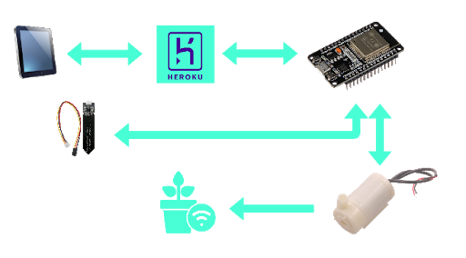
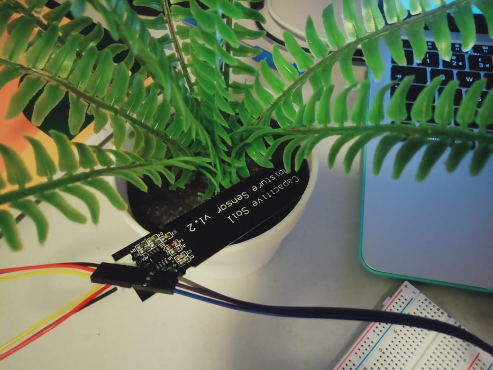
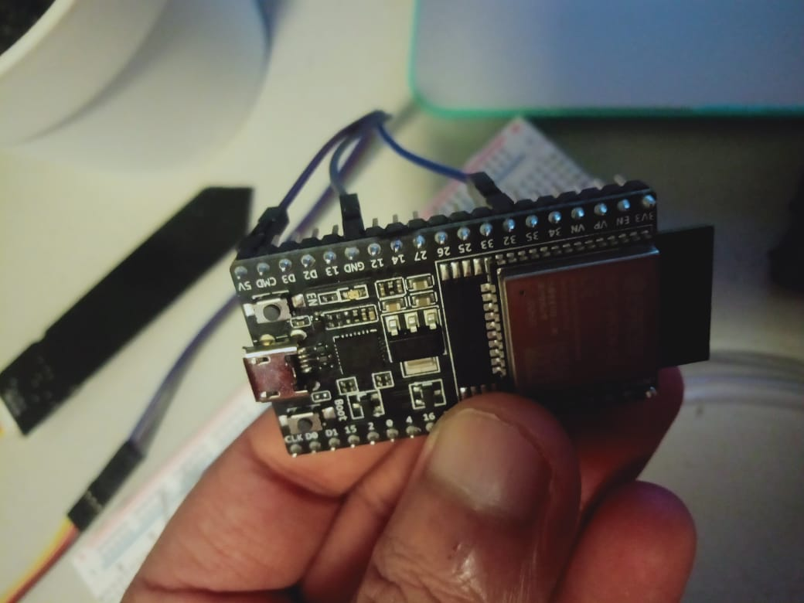

# Smart Gardening System
In this code  I have implemented a perfect example for detecting  soli  humidity and based on the soli status  it will send the message to the server based on changing the soil condition. This code  is design in that manner that whenever soil become dry it will send message to the server and  once  soil  is perfectly wet then again esp32 will send the acknowledgement message to server.

# Sensors and Gadgets Used:
1. Capacitive Soil Moisture Sensors Vol. 2
2. ESP 32
3. Relay Module
4. Motor for watering and pipe

Connected Cloud Link: "https://github.com/Adityasiwan007/IOT-Home-Automation-Backend"

## Architecture:
 

## Prototype for Smart Gardening System

    
    